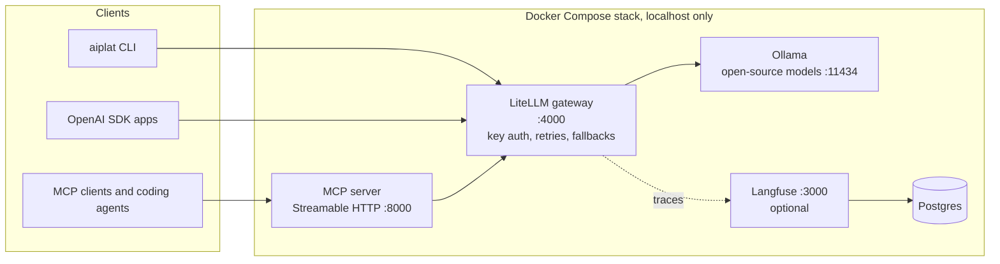

# AI Platform Lab

A small, self-managed AI platform that runs on one machine with Docker Compose. It serves open-source models through a single gateway API, exposes the platform to agents and coding tools through an MCP server, traces every model call, and keeps secrets out of the code. Everything is tested, and a CI job can start the whole stack and check it end to end.

I built it to learn the parts of an internal AI platform that sit between "the model works on my laptop" and "a team can rely on it": deployment, model access, monitoring, secrets and documentation.



## What is in it

| Part | What it does |
|---|---|
| **Ollama** | Serves open-source models (`qwen2.5:0.5b` and `llama3.2:1b` by default) on CPU, or on an NVIDIA GPU with `docker-compose.gpu.yml`. A one-shot `ollama-init` job pulls the models before anything else starts. |
| **LiteLLM gateway** | One OpenAI-compatible API in front of every model, protected by a master key. Requests that fail or time out are retried and then sent to a fallback model. Adding a hosted model is a few lines of config. |
| **MCP server** (`aiplat.mcp_server`) | Gives LLM clients and coding agents four tools: `list_models`, `ask_model`, `platform_status` and `search_runbooks`. Runs as a non-root container with a read-only filesystem. |
| **Langfuse + Postgres** (optional) | Every gateway request is traced with model, prompt, tokens, latency and errors. Started with `docker-compose.observability.yml`. |
| **`aiplat` CLI** | `status`, `models`, `chat`, `eval`, `smoke` and `secrets` commands for running the platform day to day. |
| **Runbooks** (`docs/runbooks/`) | How to add a model, rotate secrets, debug the gateway and connect a client. The MCP server can search them, so an agent can answer "how do I add a model?". |

## Quick start

Requirements: Docker with Compose v2, Python 3.11+, about 4 GB of free disk for images and models.

**Linux / macOS**

```bash
git clone https://github.com/Akshitaa-V/ai-platform-lab.git
cd ai-platform-lab
python -m venv .venv && source .venv/bin/activate
pip install -e ".[dev]"
cp .env.example .env
aiplat secrets init              # creates secrets/*.txt and .env.observability (both gitignored)
docker compose up -d --build     # first start pulls images and models, which takes a few minutes
aiplat status                    # wait until ollama, gateway and mcp are "up"
aiplat smoke                     # health, a chat through the gateway, and an MCP tool call
```

**Windows (PowerShell, Docker Desktop)**

```powershell
git clone https://github.com/Akshitaa-V/ai-platform-lab.git
cd ai-platform-lab
python -m venv .venv; .\.venv\Scripts\Activate.ps1
pip install -e ".[dev]"
Copy-Item .env.example .env
aiplat secrets init
docker compose up -d --build
aiplat status
aiplat smoke
```

With tracing: `docker compose -f docker-compose.yml -f docker-compose.observability.yml up -d`, then open http://localhost:3000 and log in as `admin@platform.local` with the password in `secrets/langfuse_admin_password.txt`.

## Using it

```bash
aiplat models                                     # what the gateway serves
aiplat chat llama3.2-1b "Explain MCP in one sentence"
aiplat eval                                       # compare every model on evals/tasks.jsonl
aiplat status --json                              # machine-readable health for monitoring
```

Any OpenAI SDK works against the gateway: base URL `http://127.0.0.1:4000/v1`, API key from `secrets/litellm_master_key.txt`.

### Connecting an MCP client

The MCP server speaks Streamable HTTP at `http://127.0.0.1:8000/mcp`. Any MCP client can use it, for example:

- **MCP Inspector** (for testing tools by hand): run `npx @modelcontextprotocol/inspector`, choose Streamable HTTP and enter the URL above
- **Coding agent CLIs**: register `http://127.0.0.1:8000/mcp` as an HTTP MCP server named `ai-platform` with the CLI's MCP add command
- **Cursor or VS Code**: add the URL as an HTTP MCP server in the editor's MCP settings

## Evaluating models

`aiplat eval` sends twelve fixed tasks to each model at temperature 0 and checks every answer with one deterministic rule (substring, exact match, regex, or JSON keys and values). The tasks are small engineering-style jobs: extract a part number to JSON, classify a ticket's priority, convert units, follow an output format. It writes `reports/leaderboard.md` and `reports/results.json` with pass rate, errors, median latency and tokens per model, so a new model can be compared with the current one before anyone depends on it.

Twelve tasks are enough to catch a model that cannot follow a format or a gateway that is misrouting requests. They are not a benchmark of model quality.

## Secrets

- `aiplat secrets init` creates one random value per file in `secrets/` with `600` permissions and never overwrites an existing file unless you pass `--force`.
- Compose mounts the files as Docker secrets under `/run/secrets/`. Postgres reads its password with `POSTGRES_PASSWORD_FILE`. LiteLLM only reads environment variables, so `platform/env-from-secrets.sh` exports each secret file as a variable inside the container just before start-up. Secret values never appear in compose files or images.
- Langfuse also only reads environment variables, so its values go in `.env.observability`, which is generated locally and gitignored.
- `aiplat secrets check` scans exactly the files Git would commit, looking for key patterns and for the exact values in `secrets/`, so a secret file added with `git add -f` is caught. CI runs it on every push.

## Testing and CI

`pytest` runs 71 tests without Docker, a network or an API key:

- the gateway client and CLI against an in-memory OpenAI-compatible fake, including timeouts, refused connections, wrong keys and malformed responses
- the MCP server through the MCP client, both in memory and over real Streamable HTTP with uvicorn, including a tool error that must fail the smoke check
- the evaluation scorer, ranking and reports
- runbook search, and secret creation, permissions and leak detection
- the deployment files: every port bound to localhost, a healthcheck on every long-running service, no `:latest` tags, no inline secrets, start-up order, both gateway configs in sync, every gateway model pulled by the init job, and `docker compose config` on all three file combinations

GitHub Actions runs lint and tests on Python 3.11 to 3.13, validates the Compose files and builds the MCP image on every push. The **End-to-end stack test** job, started from the Actions tab, pulls the real images and models, waits for the stack to become healthy, runs `aiplat smoke` and `aiplat eval`, then removes one model from Ollama to check that the gateway falls back to the other. It uploads the leaderboard as an artifact.

## Design decisions

- **Localhost only.** Every port is bound to `127.0.0.1`. Exposing the platform to a network needs a reverse proxy with TLS in front of it, which this repo does not include.
- **Gateway in the middle.** Clients never talk to Ollama directly, so models can be swapped, added or moved to a GPU host without changing any client.
- **Tracing is optional.** The core stack runs without Langfuse, and the gateway uses a separate config with tracing switched on, so a missing Langfuse never breaks requests.
- **Health first.** Every service declares a healthcheck, and Compose starts the gateway only after the models are pulled and the MCP server only after the gateway is healthy.

## Limits

- Runs on a single host. There is no high availability, autoscaling or load testing.
- The gateway uses one master key. Per-team keys and budgets need LiteLLM's database mode, which is not set up here.
- Image tags in `.env.example` should be pinned to versions you have tested. `main-stable` for LiteLLM moves over time.
- `LANGFUSE_INIT_*` variables create the Langfuse project and keys automatically on recent v2 images. If your version ignores them, create a project in the UI and copy its keys into `secrets/` (see `docs/runbooks/gateway-down.md`).
- The GPU override needs the NVIDIA Container Toolkit and has not been tested on a GPU host in this repo's CI.

## Layout

```
docker-compose.yml                 core stack: ollama, ollama-init, gateway, mcp
docker-compose.observability.yml   adds langfuse and postgres, switches on tracing
docker-compose.gpu.yml             runs ollama on an NVIDIA GPU
gateway/                           LiteLLM configs (with and without tracing)
platform/env-from-secrets.sh       exports Docker secrets as environment variables
Dockerfile.mcp                     MCP server image
src/aiplat/                        CLI, gateway client, health checks, evals, MCP server, secrets
evals/tasks.jsonl                  fixed evaluation tasks
docs/runbooks/                     operating instructions, also searchable over MCP
tests/                             71 tests
```

## License

MIT
